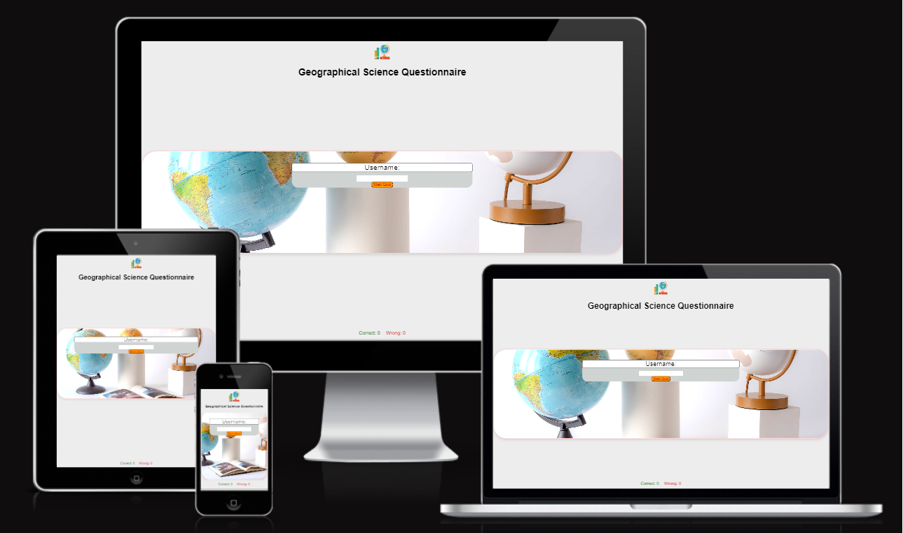
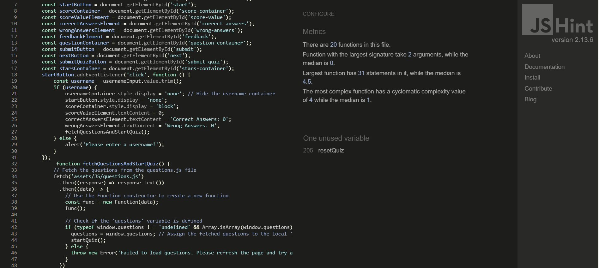

# Geographical Science Questionnaire

Sure! Here's an introduction for the Geographical Science Questionnaire, a fun and educational quiz site:

Welcome to the Geographical Science Questionnaire!

Are you ready to test your knowledge of the world's geography and explore fascinating facts about our planet? Look no further! The Geographical Science Questionnaire is an engaging and interactive quiz site that will challenge your understanding of various geographical wonders, landmarks, cultures, and more.

How well do you know the world's largest ocean or the capital cities of different countries? Can you identify famous landmarks and natural wonders from their images? This quiz will put your geographical expertise to the test and provide instant feedback on your answers, helping you learn and improve along the way.

With a wide range of thought-provoking questions and multiple-choice options, the Geographical Science Questionnaire offers an exciting and educational experience for learners of all ages. Whether you're a seasoned geography enthusiast or simply curious about the world around you, this quiz will keep you entertained while expanding your knowledge.

Instructions are simple: enter your username, start the quiz, and answer the questions to the best of your ability. Get instant feedback after each question, and watch your score grow with every correct answer.

Challenge yourself, compete with friends, and embark on a journey of exploration with the Geographical Science Questionnaire. So, are you up for the challenge? Let's dive into the world of geography together!

Visit the deployed website [here](https://anwardawoud.github.io/PP2/)

## Mockup

## Table of contents

1. [User Experience (UX)](#user-experience-ux)
    * [Project Goals](#project-goals)
    * [Color Scheme](#color-scheme)
    * [Typography](#typography)
    * [Wireframes](#Wireframes)
    * [Users stories](#users-stories)
2. [Features](#features)
    * [General](#general)
    * [Username page](#username-page)
    * [Quiz page](#quiz-page)
    * [Scores page](#scores-page)
3. [Technologies Used](#technologies-used)
    * [Languages Used](#languages-used)
    * [Frameworks, Libraries and Programs Used](#frameworks-libraries-and-programs-used)
4. [Testing](#testing)
    * [Code Validation](#code-validation)
    * [Accessibility](#accessibility)
    * [Tools Testing](#tools-testing)
    * [Testing stories](#testing-stories)
    * [Manual Testing](#manual-testing)
    * [Unfixed bugs](#unfixed-bugs)
5. [Finished Product](#finished-product)
6. [Deployment](#deployment)
    * [GitHub-deploy](#github-deploy)
7. [Credits](#credits)
    * [Content](#content)
    * [Media](#media)
    * [Code](#code)
8. [Acknowledgements](#acknowledgements)

## User experience

### Project Goals

    Interactive Quiz: Create an interactive quiz that allows users to answer geographical questions and receive instant feedback on their responses.

      * User-Friendly Experience: Design a user-friendly and intuitive interface to provide a smooth and enjoyable experience for all users.

      * Engaging Visuals: Incorporate geographical images and visually appealing elements to enhance the quiz's engagement.

      * Score Tracking: Implement a scoring system to track users' progress and display their final scores upon completing the quiz.

      * High Scores: Develop a high scores page to showcase the top performers and encourage healthy competition among users.

      * Pluming Stars Effect: Add a captivating pluming stars effect to the high scores page to make it visually impressive.

      * Easy Navigation: Ensure easy navigation between different quiz pages, allowing users to move seamlessly throughout the site.

      * Educational Value: Provide educational value through informative geographical questions that broaden users' knowledge.

      * Accessibility: Follow accessibility best practices to make the quiz accessible to a diverse audience, including proper semantic HTML, alt attributes for images, and color contrast for readability.

      * Future Implementations: Plan for future enhancements, such as adding a timer feature to limit the time for each question, implementing user authentication, and providing options to choose different geographical themes for the quiz.

      By achieving these project goals, the Geographical Science Questionnaire aims to offer an enjoyable, educational, and visually appealing experience for users interested in testing and expanding their geographical knowledge.

### Color Reference

Element                         | Color Code
-----------------------         | ----------
Primary Background              | #EDEDED
Secondary Background            | #FF7C00
Tertiary Background             | #000000
Correct Feedback Text           | Green
Incorrect Feedback Text         | Red
No-Answer Feedback Text         | Blue
Username Background             | #a5a8a7
Username Input Background       | #898989
Score Background                | #EDEDED
Score Value Background          | #EDEDED
Question Background             | #EDEDED
Option Label Background         | #EDEDED
Button Background               | #EDEDED
Start Button Background         | #FF7C00
Header and Footer Background    | #EDEDED
Score Message Background        | #b8b8b8
Star Color                      | Green

### Typography

The font-family 'Arial', sans-serif is a commonly used font combination for web typography. It specifies that the preferred font for the text should be Arial, a sans-serif font.

Using a sans-serif font like Arial can provide a clean and modern look to the typography on my website. It is a widely available font that is easy to read on various screen sizes and devices.

By specifying 'sans-serif' as a fallback option, we ensure that if Arial is not available on a user's device, the browser will automatically select a similar sans-serif font as a backup.

Overall, the font-family 'Arial', sans-serif is a reliable choice for web typography, offering readability and compatibility across different platforms

### Wireframes

### Users stories

## User Story

As a potentialAs user, I want to recommend the Geographical Science Questionnaire site to my students as a useful learning tool, so that they can reinforce their knowledge, prepare for exams, and have fun while learning about different places.

### Acceptance Criteria

- The Geographical Science Questionnaire site should have a user-friendly interface with clear instructions on how to start the quiz.

- Users should be able to enter their username before starting the quiz.

- The quiz should consist of a series of geographical questions with multiple-choice options.

- Users should receive instant feedback on their answers, indicating whether they are correct, incorrect, or if no answer was provided.

- The site should display the user's current score during the quiz.

- After completing all the questions, users should see their final score.

- The site should be responsive and work smoothly on different devices, including smartphones, tablets, and desktops.

- There should be no known bugs or issues that hinder the functionality of the site.

- The site should be deployed and accessible through GitHub Pages.

- All content, images, and code used in the site should be properly credited to their respective sources.

[back to top](#Geographical-Science-Questionnaire)

## Features

### General

* Responsive design for all device sizes.

* Respect the color scheme and display the information in a clear, concise and 
understandable way for the user.

* **Header** 

    - The header contains the web logo, a simple desing with the name of the website.
    
* **Footer**

    - The footer have the scores of correct and wrong answers (counting accordingly)

### Username Page:

* This page will serve as the landing page of the website. It will contain a form where users can enter their username to start the quiz.

### Quiz Page:

* After entering their username on the home page, users will be directed to the game page. This page will display a series of geographical questions fetched from the questions.js file. Users will be able to select an answer for each question and receive instant feedback on whether their answer is correct or incorrect. The user's current score will be displayed during the quiz.

### Scores Page:

*  This page will show the final score

[back to top](#Geographical-Science-Questionnaire)

## Technologies Used
* The Geographical Science Questionnaire quiz site utilizes various technologies to create an interactive and user-friendly experience. The technologies used in this project include:

### Languages Used

* HTML: Used for structuring the web pages and content.
* CSS: Used for styling and designing the visual elements of the website.
* JavaScript: Used to implement interactivity and functionality on the quiz site.

### Frameworks, Libraries and Programs Used

*  [balsamiq](https://balsamiq.cloud/)

     - Balsamiq was used for creating wireframes

* [CA](https://app.codeanywhere.com/)
     - Codeanywhere was used for writing code, committing, and then pushing to GitHub.

* [GitHub](https://github.com/)
     - GitHub was used to store the project after pushing.

* [Am I Responsive?](http://ami.responsivedesign.is/#)
    - Am I Responsive was used to generate mockup image. 

* [Chrome DevTools](https://developer.chrome.com/docs/devtools/)
    - Chrome DevTools was used during development process for code review and to test responsiveness.

* [jQuery] (https://jquery.com/) A lightweight JavaScript library that simplifies DOM manipulation, event handling, and animation, enabling smooth interactions and user-friendly features.

* [JSHint] JSHint is a static code analysis tool for JavaScript that detects potential errors and issues in code.

* [W3C Markup Validator](https://validator.w3.org/)
    - W3C Markup Validator was used to validate the HTML code.

* [W3C CSS Validator](https://jigsaw.w3.org/css-validator/)
    - W3C CSS Validator was used to validate the CSS code.

[back to top](#Geographical-Science-Questionnaire)

## Testing

### Code Validation

*   No errors or warnings to show.

* No errors Found.

* No errors Found.
### Accesibility

* Lighthouse Devtool from Google Chrome used for testing.
* Lighthouse testing:

 + Site:
    - Desktop version:

        

    - Mobile version:

        

### Tools testing
    
* [Chrome DevTools](https://developer.chrome.com/docs/devtools/)

    - Chrome DevTools was used to explore and modify HTML and CSS during development.
* Responsiveness
    
    - [Am I Responsive?](http://ami.responsivedesign.is/#) was used to check the website responsiveness on different screen size.

### Testing stories

* As a user, I want to test if the quiz starts correctly when I enter a valid username and click the "Start Quiz" button.

    - working as expected

* As a user, I want to verify that the questions are being fetched and displayed correctly from the questions.js file.

    - as expected

* As a user, I want to ensure that I can select an answer for each question and receive immediate feedback on whether my answer is correct or incorrect.

    - yes, as expected

* As a user, I want to check if the score is updated accurately after answering each question.

    - off course yes 

* As a user, I want to make sure that the quiz ends after all questions are answered, and the final score is displayed correctly.

    - yes, shown correctly

* As a user, I want to confirm that the pluming stars effect is displayed when my score is equal to or greater than 4.

    - yes, that displaying as planed 

* As a user, I want to test the "Retake Quiz" button functionality to see if it resets the quiz and allows me to start a new quiz.

    - Sure, been tested 

* As a user, I want to verify that the quiz site is responsive and works well on various devices, including desktops, tablets, and smartphones.

    - yes, please find attached in the current file 

### Unfixed bugs

* No unfixed bugs remaining in the website.

[back to top](#Geographical-Science-Questionnaire)

## Finished product

Page | Desktop version | Mobile version
--- | --- | ---
Username page |  | 
Quiz page |  | 
Scores page |  | 

[back to top](#Geographical-Science-Questionnaire)

## Deployment

### GitHub-deploy

* This are the steps I followed to deploy my project from its GitHub repository:

1. Open [GitHub Repository](https://github.com/) login and find the project repository.
2. At the top of the repository on the right corner click on settings button.
3. Go to Pages section inside settings.
4. Go to Branch tag and find a dropdown menu where you can choose between none or main.
5. Select main, after a short waiting GitHub will generate your website link.

[back to top](#Geographical-Science-Questionnaire)

## Credits

### Content

* All content was originally created and written by Anwar Dawoud, the developer.

### Media

* background image, which called background picture

### Code

* [W3Schools](https://www.w3schools.com/) were visited for better understanding of coding elements syntax.

[back to top](#Geographical-Science-Questionnaire)

## Acknowledgements

* Code Institute and slack community for all the support in this project

* Jack, my mentor for his kind help and his time.

* My Great Family that had been helping with giveing more time for the project.

[back to top](#Geographical-Science-Questionnaire)